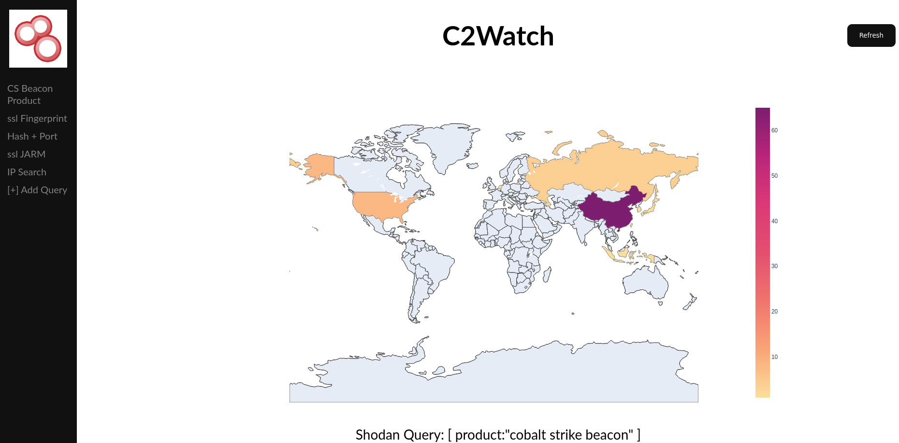

<h1 align="center">C2Watch</h1>
<p>
  <a href="https://twitter.com/ZakiPedio" target="_blank">
    
  </a>
</p>

> C2Watch is a simple Threat Intelligence framework (powered by Shodan), to aid the monitoring of Command and Control server in the wild




## Notes
I'm very sorry but this is only a simple side project, it work but it's ugly, feel free to improve it and contribute to the project!

## Install

```sh
pip install plotly
pip install pycountry
pip install shodan
pip install Flask
git clone https://github.com/ZakiPedio/C2Watch.git
```

## Usage

```sh
[Outside of the "C2Watch" folder]
python -m flask --app C2Watch run --port 8000
open your browser at http://127.0.0.1:8000
```

## Author

👤 **Zaki Pedio**

* Website: https://zakipedio.dev
* Twitter: [@ZakiPedio](https://twitter.com/ZakiPedio)
* Github: [@ZakiPedio](https://github.com/ZakiPedio)
* LinkedIn: [@Zaki Pedio](https://linkedin.com/in/Zaki Pedio)

## Show your support

Give a ⭐️ if you liked this simple project!

***
_This README was generated with ❤️ by [readme-md-generator](https://github.com/kefranabg/readme-md-generator)_
